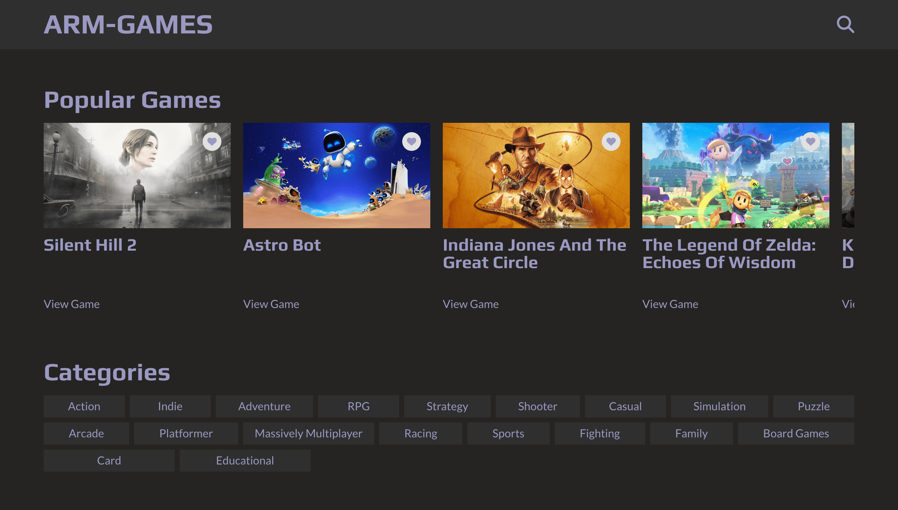

# ARM-Games

ARM-Games is a web application that fetches video game data from the RAWG.io API. Built with Vite in vanilla JavaScript, it features hash-based navigation, modals, infinite scrolling carousels, and a section to save favorite games using a like button.

## Live Demo
<a href="https://arm-games.netlify.app/" target="_blank" rel="noopener noreferrer">🚀 Deploy</a>
<a href="https://github.com/arselt/js-arm-games" target="_blank" rel="noopener noreferrer">📄 GitHub Repository</a>



## Features
- Fetches and displays video game data from RAWG.io
- Hash-based navigation for seamless browsing
- Modals for detailed game information
- Infinite scrolling in carousels
- Favorite games section with a like button

## Installation

To run this project locally, follow these steps:

1. Clone the repository:
   ```sh
   git clone https://github.com/arselt/js-arm-games.git
   cd js-arm-games
   ```
2. Install dependencies:
   ```sh
   npm install
   ```
3. Get an API key from [RAWG.io](https://rawg.io/apidocs) and create a `.env` file in the project directory:
   ```sh
   echo "VITE_API_KEY=your_api_key_here" > .env
   ```
4. Start the development server:
   ```sh
   npm run dev
   ```
